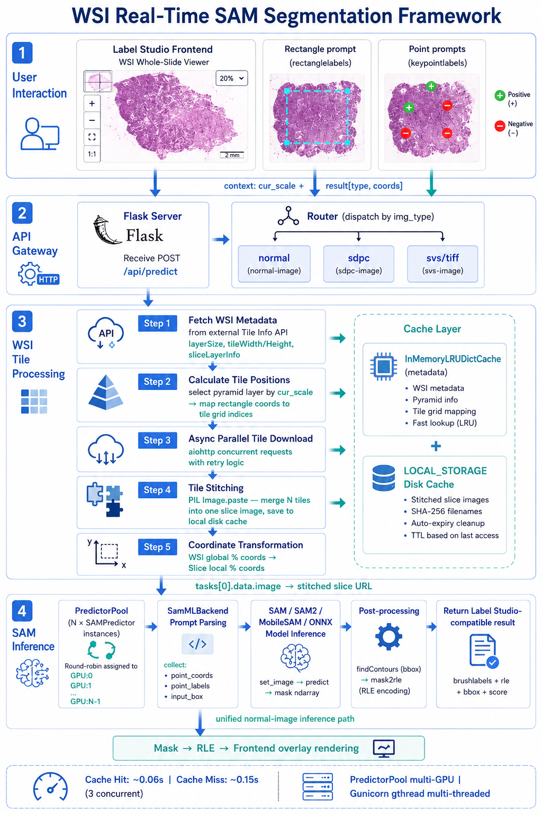
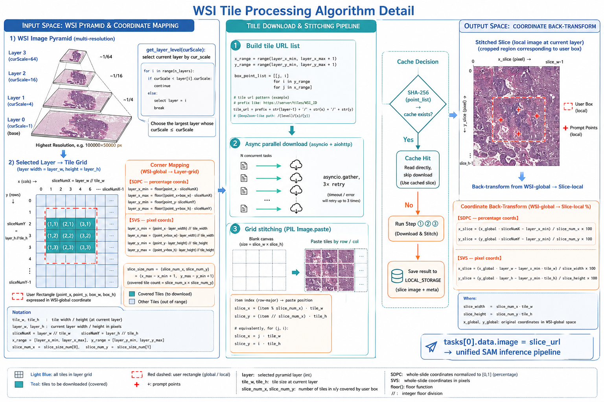

# SAM Segmentation Annotation on WSI Viewers — Technical Documentation

> 🌐 **Language**: English · [中文](./wsi-sam-segmentation.md)　|　📚 **Related docs**: [Project Home (README)](../README.md) · [API Reference](./api.md)

## 1. Overview

### 1.1 Background

Whole Slide Images (WSIs) are the core data format in digital pathology. A single WSI typically contains billions of pixels at extremely high resolution, making it impossible to load directly into GPU memory for SAM inference. This system implements a complete **"WSI tile stitching + SAM real-time segmentation"** pipeline, enabling annotators to perform interactive segmentation annotation on WSI viewers using bounding boxes and point prompts.

### 1.2 System Capabilities

- **Multi-format support**: SDPC, SVS, and TIFF — three mainstream WSI formats
- **Dual prompt modes**: `keypointlabels` (point annotation) and `rectanglelabels` (bounding box annotation), with support for mixed positive/negative points
- **Multi-model backend**: SAM, SAM2, MobileSAM, and ONNX — four inference backends
- **Multi-GPU parallelism**: PredictorPool with cross-GPU instance pooling for true parallel inference
- **Label Studio integration**: Drop-in use as a Label Studio ML Backend

---

## 2. System Architecture

### 2.1 Overall Architecture

The diagram below shows the complete WSI real-time SAM segmentation framework, organized into four layers: User Interaction, API Gateway, WSI Tile Processing, and SAM Inference.

<p align="center">
  
</p>

A detailed text-based architecture diagram follows:

```
┌─────────────────────────────────────────────────────────────────┐
│                   Label Studio Frontend                          │
│  (User draws boxes/points → sends predict request → renders mask)│
└──────────────────────────┬──────────────────────────────────────┘
                           │ HTTP POST /api/predict
                           ▼
┌──────────────────────────────────────────────────────────────────┐
│                  Flask API Layer (api.py)                         │
│  - Routes by img_type → sdpc / svs / tiff / normal              │
│  - Calls wsiHandler to process WSI tiles                        │
│  - Calls SamMLBackend.predict() for SAM inference                │
└──────────────────────────┬───────────────────────────────────────┘
                           │
            ┌──────────────┼──────────────┐
            ▼              ▼              ▼
   ┌──────────────┐ ┌────────────┐ ┌──────────────┐
   │  wsiHandler  │ │ wsiHandler │ │    normal    │
   │ .sdpc_convert│ │.svs_handler│ │  (direct     │
   │ (SDPC tiles) │ │ (SVS tiles)│ │  inference)  │
   └──────┬───────┘ └─────┬──────┘ └──────┬───────┘
          │               │               │
          ▼               ▼               │
   ┌──────────────────────────────────────┐│
   │     create_image() Tile Stitching    ││
   │  - Download N tiles (asyncio, async) ││
   │  - Stitch into single slice image    ││
   │  - Local cache (LOCAL_STORAGE)       ││
   └──────────────────┬───────────────────┘│
                      │                    │
                      ▼                    ▼
          ┌──────────────────────────────────────┐
          │       SamMLBackend (model.py)         │
          │  - Parse prompts (point/box)          │
          │  - Call PredictorPool.acquire()       │
          │  - Convert mask → RLE format          │
          │  - Return Label Studio-compatible result│
          └──────────────────┬───────────────────┘
                             │
                             ▼
          ┌──────────────────────────────────────┐
          │    PredictorPool (sam_predictor.py)   │
          │  - N × SAMPredictor instances         │
          │  - Round-robin GPU device assignment  │
          │  - Queue-based acquire/release        │
          └──────────────────┬───────────────────┘
                             │
                             ▼
          ┌──────────────────────────────────────┐
          │    SAMPredictor.predict_sam()         │
          │  - set_image() + embedding cache      │
          │  - predictor.predict(points, box)     │
          │  - findContours → bbox                │
          │  - Return mask ndarray                │
          └──────────────────────────────────────┘
```

### 2.2 Core File Reference

| File | Responsibility |
|------|---------------|
| [api.py](../src/mdi_sam_server/label_studio_ml_mdi/api.py) | Flask routing layer, dispatches `img_type` to the appropriate handler |
| [utils.py](../src/mdi_sam_server/label_studio_ml_mdi/utils.py) | WSI tile processing, image download & stitching, coordinate transformation, cache cleanup |
| [model.py (sam_backend)](../src/mdi_sam_server/sam_backend/model.py) | SAM inference business layer: prompt parsing → model inference → RLE result |
| [sam_predictor.py](../src/mdi_sam_server/sam_backend/sam_predictor.py) | SAM model wrapper, supports SAM / SAM2 / MobileSAM / ONNX |
| [settings.py](../src/mdi_sam_server/label_studio_ml_mdi/conf/settings.py) | Environment config: tile service prefixes, cache paths, cleanup parameters |

---

## 3. Core Workflow

### 3.1 End-to-End Sequence

```
User Action            Label Studio Frontend          MDI SAM Server                  WSI Tile Service
───────────            ────────────────────          ──────────────                  ────────────────
  │                           │                            │                               │
  │  1. Load WSI viewer       │                            │                               │
  │  2. Draw box / place point│                            │                               │
  ├──────────────────────────►│                            │                               │
  │                           │  3. POST /api/predict      │                               │
  │                           │  {img_type:"svs",          │                               │
  │                           │   context:{cur_scale,      │                               │
  │                           │   result:[...]}}           │                               │
  │                           ├───────────────────────────►│                               │
  │                           │                            │  4. api._predict()            │
  │                           │                            │     ├─ Parse context           │
  │                           │                            │     ├─ img_type="svs"         │
  │                           │                            │     └─ wsiHandler.svs_handler │
  │                           │                            │                               │
  │                           │                            │  5. Fetch WSI metadata        │
  │                           │                            ├──────────────────────────────►│
  │                           │                            │◄──────────────────────────────┤
  │                           │                            │   layerSize, tileSize,        │
  │                           │                            │   sliceLayerInfo              │
  │                           │                            │                               │
  │                           │                            │  6. Calculate tile positions   │
  │                           │                            │     rectangle coords→tile idx  │
  │                           │                            │     layer_x_min~max           │
  │                           │                            │                               │
  │                           │                            │  7. Concurrent tile download   │
  │                           │                            ├──────────────────────────────►│
  │                           │                            │  GET /tile/layer/x/y (N reqs)  │
  │                           │                            │◄──────────────────────────────┤
  │                           │                            │  tile JPEG images              │
  │                           │                            │                               │
  │                           │                            │  8. Stitch tiles               │
  │                           │                            │     Image.new().paste()        │
  │                           │                            │     Save as local JPEG          │
  │                           │                            │                               │
  │                           │                            │  9. SAM inference              │
  │                           │                            │     predictor.set_image()      │
  │                           │                            │     predictor.predict()        │
  │                           │                            │     Returns mask ndarray       │
  │                           │                            │                               │
  │                           │                            │  10. mask → RLE conversion     │
  │                           │                            │      brush.mask2rle()          │
  │                           │◄───────────────────────────┤                               │
  │                           │  11. predictions            │                               │
  │                           │  {results:[{type:"brush-   │                               │
  │                           │   labels", value:{rle,     │                               │
  │                           │   bbox, brushlabels}}]}    │                               │
  │◄──────────────────────────┤                            │                               │
  │  12. Render mask overlay  │                            │                               │
```

---

## 4. WSI Image Processing in Detail

### 4.1 WSI Layer (Pyramid) Structure

WSI images are typically stored in a **pyramid structure** with multiple resolution levels:

- **Layer 0** (highest resolution): the original scanned layer, e.g., 100,000 × 50,000 pixels
- **Layer 1, 2, ...**: progressively downsampled layers, each roughly 1/4 the size of the previous
- **Viewing layer**: the resolution level the user is currently browsing, identified by the `cur_scale` parameter

Each layer is further divided into fixed-size **tiles** (e.g., 256×256 or 512×512 pixels), fetched on demand via REST API.

### 4.2 img_type Routing ([api.py:39-76](src/mdi_sam_server/label_studio_ml_mdi/api.py#L39-L76))

```python
@_server.route('/api/predict', methods=['POST'])
def _predict():
    img_type = data.get('img_type', 'normal')

    if img_type == "normal":
        # Standard image: run SAM inference directly
        predictions = model.predict(tasks, context=context, **params)

    elif img_type == "sdpc":
        # SDPC format: stitch tiles first, then inference
        wsi_handler.sdpc_convert(tasks, context=context, **params)
        predictions = model.predict(tasks, context=context, **params)

    elif img_type == "svs" or img_type == "tiff":
        # SVS/TIFF format: stitch tiles first, then inference
        wsi_handler.svs_handler(tasks, context=context, **params)
        predictions = model.predict(tasks, context=context, **params)
```

**Key design decision**: WSI-type processing **transforms the task data first** (replacing the original WSI URL with the stitched slice image URL), then proceeds through the **exact same SAM inference pipeline** used for normal images. This completely decouples WSI handling from SAM inference.

### 4.3 Tile Position Calculation

#### SDPC Format ([utils.py:348-366](src/mdi_sam_server/label_studio_ml_mdi/utils.py#L348-L366))

SDPC uses a **percentage coordinate system** (0–100), calculating tile positions via `sliceNumX/sliceNumY`:

```python
# The bounding box drawn by the user on the viewer — all coordinates in percentage (0-100)
point_x     = input_data['value']['x'] / 100      # percentage → decimal
point_y     = input_data['value']['y'] / 100
box_width   = input_data['value']['width'] / 100
box_height  = input_data['value']['height'] / 100

# Calculate tile indices from the current layer's slice count
current_layer_sliceX = current_layer_info['sliceNumX']
current_layer_sliceY = current_layer_info['sliceNumY']

layer_x_min = floor(point_x * current_layer_sliceX)
layer_y_min = floor(point_y * current_layer_sliceY)
layer_x_max = floor((point_x + box_width) * current_layer_sliceX)
layer_y_max = floor((point_y + box_height) * current_layer_sliceY)
```

#### SVS Format ([utils.py:449-462](src/mdi_sam_server/label_studio_ml_mdi/utils.py#L449-L462))

SVS uses a **pixel coordinate system**, requiring conversion to pixel coordinates on the current layer first, then division by tile size:

```python
# Current layer dimensions (pixels)
current_layer_width  = current_layer_info['sliceWidth']
current_layer_height = current_layer_info['sliceHeight']

# Rectangle anchor point in layer-pixel coordinates = percentage × layer pixel dimensions
layer_x_position = int(point_x * current_layer_width)
layer_y_position = int(point_y * current_layer_height)

# Tile index = pixel position ÷ tile size
layer_x_min = layer_x_position // tile_width
layer_y_min = layer_y_position // tile_height
layer_x_max = int((point_x + box_width) * current_layer_width // tile_width)
layer_y_max = int((point_y + box_height) * current_layer_height // tile_height)
```

### 4.4 Layer Level Selection ([utils.py:513-521](src/mdi_sam_server/label_studio_ml_mdi/utils.py#L513-L521))

The system automatically selects the optimal pyramid layer based on the user's current `cur_scale`:

```python
def get_layer_level(self, layerInfo, curScale):
    level = 0
    for item in range(len(layerInfo)):
        if curScale < layerInfo[item]['curScale']:
            level = item + 1   # curScale lower than this layer → continue searching upward
        else:
            level += 1         # curScale >= this layer → use current layer
            break
    return level
```

**Selection logic**: picks the layer whose `curScale` is closest to but not less than the requested scale. This ensures the downloaded tile resolution is not lower than what the user actually sees.

---

## 5. Tile Download & Image Stitching

The figure below details the full WSI tile-processing algorithm across three parts: the **input space** (pyramid layer selection and coordinate → tile-grid mapping), the **download & stitching pipeline** (URL construction, async parallel download, grid stitching, and the SHA-256 cache decision), and the **output space** (back-transform from WSI-global to slice-local coordinates). It corresponds to the core logic covered in Sections 4–6 of this document.

<p align="center">
  
</p>

### 5.1 Async Concurrent Download ([utils.py:136-167](src/mdi_sam_server/label_studio_ml_mdi/utils.py#L136-L167))

The system uses `aiohttp` + `asyncio` for concurrent asynchronous tile downloads, with retry support (up to 3 attempts):

```python
async def download_image(session, image):
    url = image['tile_url']
    max_retry = 3
    retry_count = 0

    while retry_count < max_retry:
        try:
            async with session.get(url) as response:
                if response.status == 200:
                    image_data = await response.read()
                    image_ins = Image.open(BytesIO(image_data))
                    image['content'] = image_ins
                    image['width'] = image_ins.size[0]
                    image['height'] = image_ins.size[1]
                else:
                    raise Exception("Failed to download image")
            break
        except Exception as e:
            retry_count += 1
            if retry_count < max_retry:
                await asyncio.sleep(2)  # backoff delay
                continue
            else:
                raise e
```

### 5.2 Tile Stitching ([utils.py:221-300](src/mdi_sam_server/label_studio_ml_mdi/utils.py#L221-L300))

The `create_image()` method stitches multiple tiles into a single slice image by arranging them in a grid:

```python
# Calculate stitched image dimensions
slice_width = 0
slice_height = 0
for item, image in enumerate(image_url_list):
    if item // slice_size_num[0] == 0:
        slice_width += image['width']      # accumulate first-row widths
    if item % slice_size_num[0] == 0:
        slice_height += image['height']    # accumulate first-column heights

# Create blank canvas
slice_image = Image.new('RGB', (slice_width, slice_height), 'white')

# Paste tiles in grid order
for item, image in enumerate(image_url_list):
    slice_x = int(item % slice_size_num[0] * tile_size[0])   # col index × tile width
    slice_y = int(item // slice_size_num[0] * tile_size[1])  # row index × tile height
    slice_image.paste(image["content"], (slice_x, slice_y))
```

### 5.3 Stitched Image Caching

Stitched images are saved to local disk with a **hash-based filename**. Subsequent identical requests hit the cache directly:

```python
# Filename = original name + layer + coordinate hash
hash_name = hashlib.sha256(str(point_list).encode('utf-8')).hexdigest()
slice_filename = image_filename + '_' + str(layer) + '_' + hash_name + '.jpeg'
local_slice_filename = os.path.join(CONFIG.local_storage, slice_filename)

# Cache hit: read dimensions from file directly, skip all network I/O
if os.path.exists(local_slice_filename):
    with Image.open(local_slice_filename) as cached_img:
        slice_width, slice_height = cached_img.size
    return url_slice_filename, slice_width, slice_height
```

---

## 6. Coordinate Transformation in Detail

### 6.1 Purpose

When a user draws a bounding box on the WSI viewer, the coordinates are **percentages relative to the entire WSI**. However, after tile stitching, what is actually passed to SAM inference is a **cropped local slice image**. The prompt coordinates must therefore be transformed from "WSI global percentage coordinates" to "slice local percentage coordinates."

### 6.2 SDPC Coordinate Transformation ([utils.py:381-398](src/mdi_sam_server/label_studio_ml_mdi/utils.py#L381-L398))

```python
# Core transformation formulas
for ctx in context['result']:
    point_x_ins = ctx['value']['x'] / 100   # Input: WSI global % (0-100) → decimal
    point_y_ins = ctx['value']['y'] / 100

    # Transform: relative % on the slice image
    # (global decimal × total slices in this layer − start slice index) / stitched slice count × 100
    ctx['value']['x'] = (point_x_ins * current_layer_sliceX - layer_x_min) / slice_width_num * 100
    ctx['value']['y'] = (point_y_ins * current_layer_sliceY - layer_y_min) / slice_height_num * 100

    # Rectangle width/height — same logic
    if ctx['type'] == "rectanglelabels":
        box_width_ins = ctx['value']['width'] / 100
        ctx['value']['width']  = box_width_ins * current_layer_sliceX / slice_width_num * 100
        ctx['value']['height'] = box_height_ins * current_layer_sliceY / slice_height_num * 100
```

### 6.3 SVS Coordinate Transformation ([utils.py:488-504](src/mdi_sam_server/label_studio_ml_mdi/utils.py#L488-L504))

SVS uses a pixel coordinate system, with slightly different transformation formulas:

```python
# SVS coordinate transformation
ctx['value']['x'] = (point_x_ins * current_layer_width - layer_x_min * tile_width) / slice_width * 100
ctx['value']['y'] = (point_y_ins * current_layer_height - layer_y_min * tile_height) / slice_height * 100

# Rectangle
ctx['value']['width']  = box_width_ins * current_layer_width / slice_width * 100
ctx['value']['height'] = box_height_ins * current_layer_height / slice_height * 100
```

### 6.4 Transformation Diagram

```
┌─────────────────────────────────────┐
│          WSI Global (100×100%)       │
│                                     │
│      ┌─────────────────┐            │
│      │  User-drawn box  │            │
│      │  x=67.65, y=37.3 │            │
│      │  w=0.2,   h=0.2  │            │
│      └────────┬────────┘            │
│               │                     │
│               │ Tile stitching +    │
│               │ coord transform     │
│               ▼                     │
│  ┌─────────────────────────────┐    │
│  │     Slice Image (local)      │    │
│  │                             │    │
│  │  ┌───────────────┐          │    │
│  │  │ Transformed    │          │    │
│  │  │ coords        │          │    │
│  │  │ x=45.2,y=33.1 │          │    │
│  │  │ w=15.8,h=12.3 │          │    │
│  │  └───────────────┘          │    │
│  └─────────────────────────────┘    │
│                                     │
└─────────────────────────────────────┘
```

---

## 7. SAM Model Inference

### 7.1 Prompt Parsing ([model.py:19-68](src/mdi_sam_server/sam_backend/model.py#L19-L68))

`SamMLBackend` parses two types of user prompts from the context:

```python
def predict(self, tasks, context=None, **kwargs):
    point_coords = []   # [[x1,y1], [x2,y2], ...]
    point_labels = []   # [1, 1, 0, ...]  1=positive, 0=negative
    input_box = None    # [x, y, x+w, y+h]

    for ctx in context['result']:
        x = ctx['value']['x'] * image_width / 100    # percentage → pixel coordinates
        y = ctx['value']['y'] * image_height / 100

        if ctx_type == 'keypointlabels':
            point_coords.append([int(x), int(y)])
            point_labels.append(int(ctx['is_positive']))  # positive / negative sample

        elif ctx_type == 'rectanglelabels':
            box_width  = ctx['value']['width'] * image_width / 100
            box_height = ctx['value']['height'] * image_height / 100
            input_box = [int(x), int(y), int(box_width + x), int(box_height + y)]
```

**The two prompt types can be mixed**: for example, draw a bounding box to define a broad region of interest, then add keypoints for precise target indication.

### 7.2 SAM Inference ([sam_predictor.py:193-239](src/mdi_sam_server/sam_backend/sam_predictor.py#L193-L239))

```python
def predict_sam(self, img_path, point_coords=None, point_labels=None, input_box=None):
    # Step 1: Load image and compute image embedding
    self.set_image(img_path, calculate_embeddings=False)

    # Step 2: Call SAM predictor
    masks, probs, logits = self.predictor.predict(
        point_coords=point_coords,    # positive/negative sample points
        point_labels=point_labels,    # 1/0 labels
        box=input_box,                # bounding box [x,y,x2,y2]
        multimask_output=False        # single mask output
    )

    # Step 3: Compute bounding box from mask
    contours, _ = cv2.findContours(mask, cv2.RETR_EXTERNAL, cv2.CHAIN_APPROX_SIMPLE)
    x, y, w, h = cv2.boundingRect(contours)

    return {
        'masks': [mask],
        'probs': [float(probs[0])],
        'bbox':  [x, y, w, h]
    }
```

### 7.3 Mask → RLE Format ([model.py:70-99](src/mdi_sam_server/sam_backend/model.py#L70-L99))

The SAM output is a binary numpy array; it must be converted to Label Studio's RLE (Run-Length Encoding) format:

```python
def get_results(self, masks, probs, width, height, bbox, label, cur_scale):
    results = []
    for mask, prob in zip(masks, probs):
        mask = mask * 255                    # binary → 255
        rle = brush.mask2rle(mask)           # numpy → RLE

        results.append({
            'original_width': width,
            'original_height': height,
            'layer_cur_scale': cur_scale,     # WSI-specific: records current layer scale
            'value': {
                'format': 'rle',
                'rle': rle,                   # RLE encoding
                'bbox': bbox,                 # bounding rectangle
                'brushlabels': [label],
            },
            'score': prob,
            'type': 'brushlabels',
        })
    return [{'result': results, 'model_version': PREDICTOR_POOL.model_name}]
```

---

## 8. Caching Strategy

### 8.1 Multi-Level Cache Architecture

| Cache Level | Implementation | Purpose |
|-------------|---------------|---------|
| WSI Metadata Cache | `InMemoryLRUDictCache(50)` | Cache sliceLayerInfo to avoid repeated HTTP requests |
| Stitched Tile Cache | `LOCAL_STORAGE` disk cache | Directly reuse stitched images for same region + same layer |
| Image Embedding Cache | `InMemoryLRUDictCache(1)` | Reuse embedding across multiple predict calls on the same image |
| Predictor Instance Pool | `PredictorPool` | Preload N model instances to eliminate serial queuing |

### 8.2 Automatic Cache Cleanup ([utils.py:523-580](src/mdi_sam_server/label_studio_ml_mdi/utils.py#L523-L580))

A background daemon thread periodically purges expired stitched tile cache files:

```python
def start_cache_cleanup_scheduler():
    interval_seconds = CONFIG.cache_clean_interval_hours * 3600

    def _run():
        while True:
            time.sleep(interval_seconds)
            cleanup_local_storage()   # Delete files unaccessed for > cache_max_age_hours

    t = threading.Thread(target=_run, daemon=True, name="cache-cleanup")
    t.start()
```

Configuration:

```shell
CACHE_MAX_AGE_HOURS=24         # File retention period (hours)
CACHE_CLEAN_INTERVAL_HOURS=1   # Cleanup check interval (hours)
```

---

## 9. Performance & Concurrency

### 9.1 Multi-Instance Parallel Inference ([sam_predictor.py:304-358](src/mdi_sam_server/sam_backend/sam_predictor.py#L304-L358))

`PredictorPool` is the system's core performance component:

```python
class PredictorPool:
    def __init__(self, model_choice, pool_size):
        for i in range(pool_size):
            if gpu_count > 0:
                device = f"cuda:{i % gpu_count}"  # Round-robin GPU assignment
            else:
                device = "cpu"
            predictor = SAMPredictor(model_choice, device=device)
            self._pool.put(predictor)

    @contextmanager
    def acquire(self):
        predictor = self._pool.get()   # Get idle instance (blocking if all busy)
        try:
            yield predictor
        finally:
            self._pool.put(predictor)  # Return instance to pool
```

**How it works**:
- Each `SAMPredictor` instance is bound to a specific GPU device
- Requests acquire an idle instance from the queue via `acquire()`
- The instance is automatically returned after inference completes
- True cross-device parallel inference is possible in multi-GPU scenarios

### 9.2 Benchmark Data

| Scenario | Sequential | Concurrent | Speedup |
|----------|-----------|------------|---------|
| Cache miss (tile download needed) | 0.713s | 0.145s | **4.9×** |
| Cache hit (tiles already cached) | 0.074s | 0.061s | ~1.2× |

---

## 10. API Usage Guide

### 10.1 WSI Segmentation Request Examples

#### SDPC Format

```json
{
    "tasks": [{
        "data": {
            "image": "http://mdi.hkust-gz.edu.cn/wsi/sdpc/api/sliceInfo/sdpc/20211025_065925_0%238_11"
        }
    }],
    "task_id": "1",
    "img_type": "sdpc",
    "params": {
        "context": {
            "cur_scale": 1.1,
            "result": [
                {
                    "original_width": 3840,
                    "original_height": 2160,
                    "image_rotation": 0,
                    "value": {
                        "x": 67.65,
                        "y": 37.3,
                        "width": 0.2,
                        "height": 0.2,
                        "rectanglelabels": ["Tumor"]
                    },
                    "type": "rectanglelabels",
                    "origin": "manual"
                },
                {
                    "original_width": 3840,
                    "original_height": 2160,
                    "image_rotation": 0,
                    "value": {
                        "x": 67.72,
                        "y": 37.36,
                        "width": 0.2,
                        "keypointlabels": ["Tumor"]
                    },
                    "is_positive": true,
                    "type": "keypointlabels",
                    "origin": "manual"
                }
            ]
        }
    }
}
```

#### SVS Format

```json
{
    "tasks": [{
        "data": {
            "image": "https://your-host/wsi/metaservice/api/sliceInfo/openslide/sample-001"
        }
    }],
    "task_id": "2",
    "img_type": "svs",
    "params": {
        "context": {
            "cur_scale": 0.03,
            "result": [
                {
                    "original_width": 1920,
                    "original_height": 1080,
                    "image_rotation": 0,
                    "value": {
                        "x": 50.0,
                        "y": 50.0,
                        "width": 5.0,
                        "height": 5.0,
                        "rectanglelabels": ["Cell"]
                    },
                    "type": "rectanglelabels",
                    "origin": "manual"
                }
            ]
        }
    }
}
```

### 10.2 Response Format

```json
{
    "results": [{
        "model_version": "SAM2:../models/sam2_hiera_base_plus.pt:cuda:0",
        "result": [{
            "id": "33ce",
            "original_width": 672,
            "original_height": 672,
            "image_rotation": 0,
            "layer_cur_scale": 1.0,
            "readonly": false,
            "score": 0.7698,
            "type": "brushlabels",
            "value": {
                "format": "rle",
                "rle": [12, 5, 8, 3, ...],
                "bbox": [400, 257, 51, 78],
                "brushlabels": ["Tumor"]
            }
        }]
    }]
}
```

### 10.3 Key Parameters

| Parameter | Type | Description |
|-----------|------|-------------|
| `img_type` | string | **Required for WSI**. Options: `sdpc` / `svs` / `tiff` / `normal` |
| `context.cur_scale` | float | **Required for WSI**. Current viewer scale, used to select the correct WSI layer |
| `context.result[].type` | string | `keypointlabels` (point) or `rectanglelabels` (bounding box) |
| `context.result[].is_positive` | bool | Keypoint mode only. `true`=positive sample, `false`=negative sample |
| `context.result[].value.x/y` | float | **Percentage** coordinates in 0–100 range |
| `context.result[].value.width/height` | float | Bounding box percentage width/height |
| `task_id` | string | Task identifier for distinguishing annotation tasks |

---

## 11. Environment Configuration

### 11.1 WSI-Related Configuration

```shell
# SDPC tile service
SDPC_TILE_PREFIX=https://your-host/wsi/sdpc/api/sliceInfo/sdpc/
SDPC_TILE_IMAGEURL=https://your-host/wsi/sdpc/api/tile/sdpc/

# SVS/TIFF tile service
SVS_TILE_PREFIX=https://your-host/wsi/metaservice/api/sliceInfo/openslide/
SVS_TILE_IMAGEURL=https://your-host/wsi/metaservice/api/tile/openslide/

# Stitched tile local cache directory
LOCAL_STORAGE=/home/mdi/.cache/label-studio/

# Automatic cache cleanup
CACHE_MAX_AGE_HOURS=24
CACHE_CLEAN_INTERVAL_HOURS=1
```

### 11.2 WSI Tile Service Requirements

The system depends on an external WSI tile service providing the following APIs:

1. **Slice Info API**: `GET ${PREFIX}/{image_id}`
   - Returns `basisInfo` (tileWidth, tileHeight, layerSize)
   - Returns `sliceLayerInfo` or `sliceInfo` (per-layer metadata)

2. **Tile Image API**: `GET ${IMAGEURL}/{image_id}/{layer}/{x}/{y}`
   - Returns a single tile as a JPEG/PNG image

---

## 12. Key Design Principles

### 12.1 Unified WSI & Normal Image Pipeline

Core design philosophy: **WSI-specific processing is limited to "WSI URL + coordinates → slice image URL + transformed coordinates."** All subsequent SAM inference reuses the normal image pipeline identically. This ensures:

- Low coupling: WSI processing logic (`utils.py`) and SAM inference logic (`model.py`) are fully independent
- Adding a new WSI format only requires implementing an `xxx_handler()` method
- SAM model upgrades do not affect WSI processing

### 12.2 Unified Coordinate System

All prompt coordinates use **0–100 percentage coordinates**, independent of the original image dimensions. The `original_width/original_height` parameters are used at inference time to convert back to pixel coordinates.

### 12.3 Layered Cache Design

- **Memory layer**: high-frequency hot data (metadata, embeddings), LRU eviction
- **Disk layer**: stitched tile images, content-based hash naming + time-based expiration cleanup
- **Instance layer**: PredictorPool preloads model instances, eliminating cold-start latency
